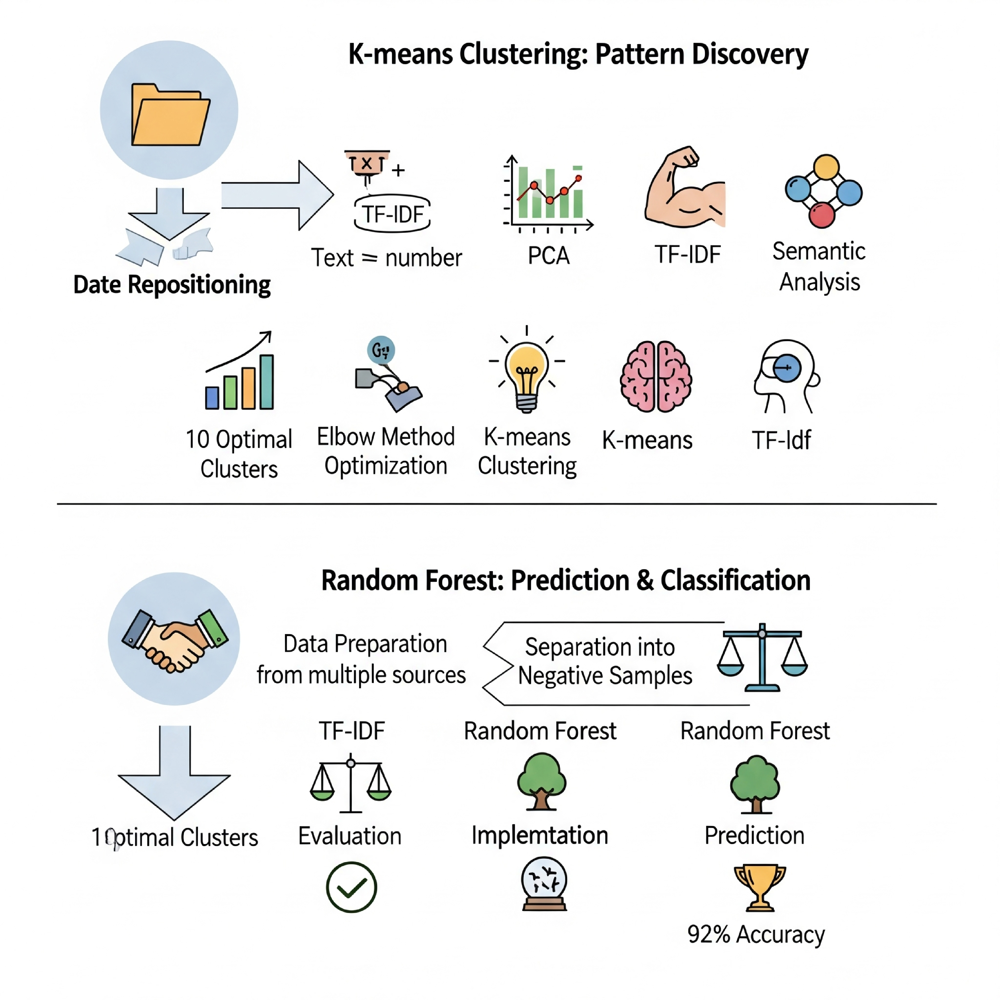

# 🧬 PharmaAI: Revolutionizing Drug Repositioning 🚀



---

## 💡 The Grand Challenge: Unlocking New Cures Faster!

Drug discovery is a monumental quest: incredibly costly, painstakingly slow, and fraught with high failure rates. But what if we could **fast-track innovation** by giving existing, approved drugs a second life? Welcome to the world of **Drug Repositioning** – where artificial intelligence isn't just a tool, it's a **game-changer**!

## ✨ What is Drug Repositioning (and Why It's Huge!)?

Drug Repositioning (or repurposing) is the ingenious strategy of finding *new therapeutic uses* for drugs already on the market. Think of a common pain reliever, suddenly discovered to combat a rare disease! 🤯 This isn't just smart; it's a paradigm shift because:

* **⚡️ Speed:** Bypasses years of early-stage trials.
* **💸 Cost-Effective:** Drastically cuts down R&D expenses.
* **🛡️ Safer Bets:** Leveraging drugs with known safety profiles.

This repository unveils two cutting-edge Machine Learning journeys, each designed to illuminate uncharted territories in drug-disease relationships. Dive in! 👇

---

## Part 1: 🌐 K-means Clustering – Decoding Hidden Similarities

Our first expedition takes us into the realm of **unsupervised learning**, where `K-means Clustering` acts as our compass to reveal natural groupings and semantic patterns within vast datasets of drug-disease associations based on their textual similarities. It's about uncovering the "why" behind the connections! 🕵️‍♀️

### 🗺️ The Discovery Journey:

1.  **Data Harmonization:** 📚 Meticulously merging comprehensive datasets from diverse sources (`mapping.csv`, `drugsInfo.csv`, `diseasesInfo.csv`) to create a unified knowledge base.
2.  **Semantic Sculpting (TF-IDF):** 📝➡️🔢 Transforming raw textual descriptions (drug/disease profiles) into powerful numerical vectors using `TfidfVectorizer`, capturing the true essence of each term.
3.  **Dimension Taming (PCA):** 📉 Applying `Principal Component Analysis` to distill complex, high-dimensional data into its most informative components, making clustering both efficient and insightful.
4.  **Optimal Grouping (Elbow Method):** 💪 Employing the `Elbow Method` to pinpoint the ideal number of clusters. Our rigorous analysis led to the identification of **10 perfectly balanced, optimal clusters** – a blueprint for new hypotheses! 🎯
5.  **K-means Alchemy:** 💡 Unleashing the `KMeans` algorithm to group similar drug-disease associations, revealing inherent structures in the data.
6.  **Cluster Chronicles:** 🧠 For each of our 10 clusters, we performed a deep semantic dive, unearthing:
    * **Top Keywords:** The defining vocabulary for each group, painting a clear picture of their therapeutic focus.
    * **Example Drugs & Diseases:** Real-world examples populating each cluster, providing tangible insights for further research.

### 🛠️ Core Technologies:
`Python` | `pandas` | `numpy` | `scikit-learn` | `matplotlib`

### 📓 Explore the K-means Notebook:
[**DrugsRepositioning_K-means_EN.ipynb**](https://github.com/VicDc/Drugs-Repositioning/blob/main/DrugsRepositioning_K-means_EN.ipynb)

---

## Part 2: 🚀 Random Forest Classification – Predicting the Future of Medicine

Our second adventure harnesses the predictive prowess of **supervised learning** with a `Random Forest Classifier`. This is where we build a robust model to actively predict *new, unknown* drug-disease associations, propelling drug discovery into a new era of efficiency! 🔭

### 📈 The Prediction Pipeline:

1.  **Unified Data Fabric:** 🤝 Seamlessly integrating all relevant drug and disease features into a rich, comprehensive dataset.
2.  **Balanced Learning (Positive & Negative Samples):** ⚖️ Crafting a meticulously balanced training ground with **42,200 confirmed associations** and **42,200 intelligently generated negative samples**, creating a powerful dataset of **84,400 samples** for unbiased learning.
3.  **Semantic Power-Up (TF-IDF):** 📝➡️🔢 Just like in Part 1, `TfidfVectorizer` transforms textual descriptions into the precise numerical language our model understands.
4.  **Forest of Insight (Random Forest):** 🌳 Training a formidable `RandomForestClassifier` to learn intricate patterns and make high-confidence predictions on potential new drug applications.
5.  **Validation & Victory:** ✅ Rigorous evaluation confirmed the model's exceptional performance:
    * **Accuracy: A staggering 92%** 🏆
    * **Precision: 92%**
    * **Recall: 92%**
    * **F1-Score: 92%**
    These metrics validate a highly reliable predictive engine!
6.  **Visionary Predictions:** 🔮 Generating concrete predictions for new drug-disease pairings. These are then brought to life through an interactive **Force Layout Graph**, allowing researchers to visually explore and confirm promising leads.

### 🛠️ Core Technologies:
`Python` | `pandas` | `numpy` | `scikit-learn`

### 📓 Explore the Random Forest Notebook:
[**drug_repositioning_randomforest_v4_en.ipynb**](https://github.com/VicDc/Drugs-Repositioning/blob/main/drug_repositioning_randomforest_v4_en.ipynb)

---

## 👨‍💻 Ready to Explore? Dive In!

Curiosity piqued? Ready to see the code in action?

1.  **Clone the Magic:**
    ```bash
    git clone [https://github.com/YourUsername/Drugs-Repositioning.git](https://github.com/YourUsername/Drugs-Repositioning.git)
    ```
2.  **Step Inside:**
    ```bash
    cd Drugs-Repositioning
    ```
3.  **Unleash the Notebooks:** Open with your preferred environment (Jupyter Lab/Notebook, VS Code, Google Colab)!

Your contributions, ideas, and feedback are incredibly welcome! Let's build the future of medicine, together. ✨

---
